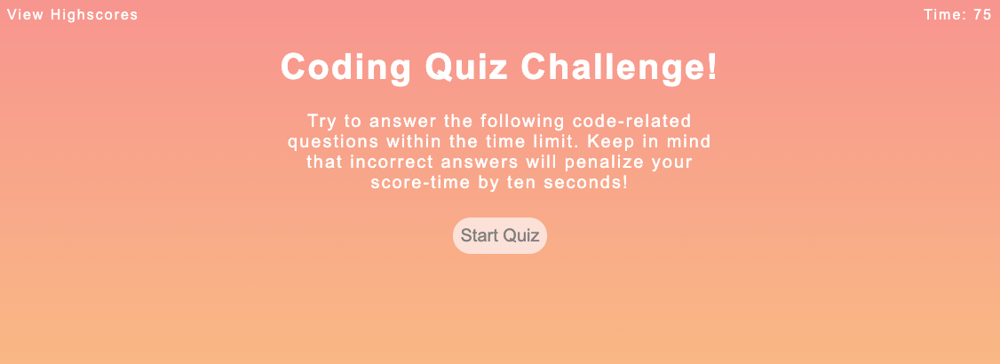

## Code Quiz 

A timed coding quiz with multiple-choice questions. When questions are answered incorectly, time is subtracted from the clock. After all questions are answered or timer has reached 0, the game is over and are prompted to save initials and score. 

## The Mock-Up: 

The following animation demonstrates the application functionality we are trying to acheive. 

## Screenshot of live page:

## Links:
To Repo:
https://github.com/merikettapearl212/code_Quiz

To live site:
https://merikettapearl212.github.io/code_Quiz/

